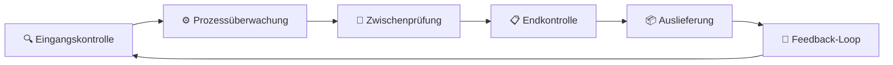
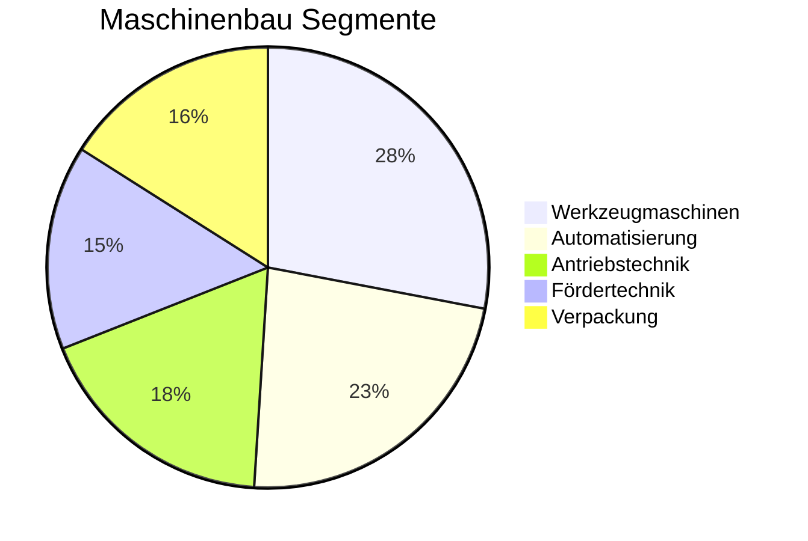

# 🇩🇪 Made in Germany: Basisinformationen & Leitfaden

<div align="center">

```ascii
███╗   ███╗ █████╗ ██████╗ ███████╗    ██╗███╗   ██╗     ██████╗ ███████╗██████╗ ███╗   ███╗ █████╗ ███╗   ██╗██╗   ██╗
████╗ ████║██╔══██╗██╔══██╗██╔════╝    ██║████╗  ██║    ██╔════╝ ██╔════╝██╔══██╗████╗ ████║██╔══██╗████╗  ██║╚██╗ ██╔╝
██╔████╔██║███████║██║  ██║█████╗      ██║██╔██╗ ██║    ██║  ███╗█████╗  ██████╔╝██╔████╔██║███████║██╔██╗ ██║ ╚████╔╝ 
██║╚██╔╝██║██╔══██║██║  ██║██╔══╝      ██║██║╚██╗██║    ██║   ██║██╔══╝  ██╔══██╗██║╚██╔╝██║██╔══██║██║╚██╗██║  ╚██╔╝  
██║ ╚═╝ ██║██║  ██║██████╔╝███████╗    ██║██║ ╚████║    ╚██████╔╝███████╗██║  ██║██║ ╚═╝ ██║██║  ██║██║ ╚████║   ██║   
╚═╝     ╚═╝╚═╝  ╚═╝╚═════╝ ╚══════╝    ╚═╝╚═╝  ╚═══╝     ╚═════╝ ╚══════╝╚═╝  ╚═╝╚═╝     ╚═╝╚═╝  ╚═╝╚═╝  ╚═══╝   ╚═╝   
```


[]()
[]()
[]()
[]()

**🎯 Der umfassende Leitfaden für deutsche Qualität, Innovation und Exportexzellenz**

### 📖 Ihr Wegweiser zur deutschen Industriekultur
*Verstehen • Anwenden • Exportieren • Skalieren*

</div>

---

## 🌐 Willkommen im Made in Germany Universe

Dieses Repository ist Ihr umfassender Leitfaden für das Verständnis und die Anwendung des "Made in Germany"-Qualitätssiegels. Deutschland steht weltweit für außergewöhnliche Ingenieurskunst, präzise Fertigung und innovative Technologien. Hier finden Sie alle Informationen, die Sie benötigen, um die Prinzipien deutscher Exzellenz zu verstehen und erfolgreich im internationalen Handel anzuwenden.

Von der historischen Entwicklung des Qualitätssiegels bis hin zu modernen Export- und Compliance-Anforderungen - dieser Leitfaden bietet strukturierte Informationen für Unternehmer, Entwickler, Studenten und Industrieexperten. Entdecken Sie, wie deutsche Standards Ihren Geschäftserfolg international vorantreiben können.

---

## 📚 Inhaltsübersicht

<div align="center">

| Sektion | Thema | Status | Relevanz |
|---------|-------|--------|----------|
| [🏛️ Grundlagen](#-grundlagen-von-made-in-germany) | Historische Entwicklung & Bedeutung | ✅ Vollständig | ⭐⭐⭐⭐⭐ |
| [🔧 Qualität](#-qualität-und-standards) | Standards & Qualitätssicherung | ✅ Vollständig | ⭐⭐⭐⭐⭐ |
| [🚀 Innovation](#-innovation-und-hightech-produkte) | Technologie & Forschung | ✅ Vollständig | ⭐⭐⭐⭐ |
| [🌍 Export](#-export-und-international-trade) | Internationaler Handel | ✅ Vollständig | ⭐⭐⭐⭐⭐ |
| [🛠️ Service](#-service-und-support) | Kundenbetreuung & Support | ✅ Vollständig | ⭐⭐⭐⭐ |
| [📋 Zertifizierung](#-zertifikationen-und-compliance) | Compliance & Standards | ✅ Vollständig | ⭐⭐⭐⭐⭐ |
| [🏭 Branchen](#-branchenspezifische-excellence) | Fachbereiche & Spezialisierung | ✅ Vollständig | ⭐⭐⭐⭐ |

</div>

---

## 🏛️ Grundlagen von "Made in Germany"

### 🎯 Historische Entwicklung

Das Label "Made in Germany" entstand im späten 19. Jahrhundert ursprünglich als Herkunftsbezeichnung für britische Verbraucher. Was zunächst als Warnung gedacht war, entwickelte sich schnell zum Qualitätssiegel. Deutsche Hersteller verwandelten diese Kennzeichnung durch konsequente Qualitätsarbeit und Innovationskraft in ein weltweit anerkanntes Gütesiegel.

Die deutsche Industriekultur basiert auf jahrhundertealter Handwerkstradition, die durch moderne Technologie und systematische Prozessoptimierung ergänzt wird. Diese einzigartige Kombination schafft Produkte, die nicht nur funktional exzellent sind, sondern auch langlebig und zuverlässig.

### 🔍 Kernprinzipien

<table>
<tr>
<td width="50%">

#### ⚡ Präzision & Zuverlässigkeit
- **Millimetergenauigkeit** in der Fertigung
- **Null-Fehler-Toleranz** bei kritischen Komponenten  
- **Langzeittests** vor Markteinführung

</td>
<td width="50%">

#### 🎓 Kontinuierliche Verbesserung
- **Kaizen-Philosophie** in der Produktion
- **Forschung & Entwicklung** als Investitionspriorität
- **Mitarbeiterqualifikation** auf höchstem Niveau

</td>
</tr>
</table>

---

## 🔧 Qualität und Standards

### 📊 Qualitätsmanagementsysteme

Deutsche Unternehmen setzen auf bewährte Qualitätsmanagementsysteme, die weit über internationale Mindeststandards hinausgehen. Die Implementierung von ISO 9001, DIN-Normen und branchenspezifischen Zertifizierungen gewährleistet konsistente Qualität in allen Produktionsphasen.

<div align="center">


</div>

### 🎯 Qualitätssicherungsmaßnahmen



Die deutsche Qualitätsphilosophie umfasst präventive Maßnahmen, kontinuierliche Überwachung und systematische Verbesserung. Jeder Produktionsschritt wird dokumentiert und analysiert, um höchste Qualitätsstandards zu gewährleisten und Kundenerwartungen zu übertreffen.

---

## 🚀 Innovation und Hightech-Produkte

### 💡 Forschung & Entwicklung

Deutschland investiert jährlich über 3% des BIP in Forschung und Entwicklung - einer der höchsten Werte weltweit. Diese Investitionen fließen in zukunftsweisende Technologien wie Industrie 4.0, Künstliche Intelligenz, Quantencomputing und nachhaltige Energiesysteme.

### 🔬 Innovationsschwerpunkte

<details>
<summary>🤖 <strong>Industrie 4.0 & Automatisierung</strong></summary>

Deutsche Unternehmen führen die vierte industrielle Revolution an mit intelligenten Fertigungssystemen, IoT-Integration und vollautomatisierten Produktionslinien. Diese Technologien ermöglichen flexible, effiziente und ressourcenschonende Produktion.
</details>

<details>
<summary>🧬 <strong>Biotechnologie & Medizintechnik</strong></summary>

Innovative medizinische Geräte und biotechnologische Lösungen aus Deutschland setzen internationale Standards. Von präzisen Diagnostikgeräten bis zu revolutionären Therapiesystemen - deutsche Medizintechnik rettet Leben weltweit.
</details>

<details>
<summary>⚡ <strong>Energietechnologie & Nachhaltigkeit</strong></summary>

Deutschland ist Vorreiter bei erneuerbaren Energien, Energiespeicherung und Wasserstofftechnologie. Deutsche Innovationen treiben die globale Energiewende voran und schaffen nachhaltige Lösungen für die Zukunft.
</details>

<details>
<summary>🚗 <strong>Mobilität der Zukunft</strong></summary>

Elektromobilität, autonomes Fahren und intelligente Verkehrssysteme - deutsche Automobilhersteller und Zulieferer gestalten die Zukunft der Mobilität mit innovativen Technologien und nachhaltigen Antriebskonzepten.
</details>

---

## 🌍 Export und International Trade

### 📈 Globale Marktposition

Deutschland ist eine der führenden Exportnationen weltweit mit einem Exportvolumen von über 1,8 Billionen Euro jährlich. Deutsche Produkte sind in über 200 Ländern verfügbar und genießen höchstes Vertrauen bei internationalen Kunden.

| Exportbereich | Weltmarktanteil | Trend |
|---------------|-----------------|-------|
| 🚛 **Maschinenbau** | 16,2% | ↗️ Wachsend |
| 🚗 **Automobilindustrie** | 13,8% | ↗️ Wachsend |
| 🧪 **Chemische Industrie** | 11,4% | ↗️ Wachsend |
| ⚡ **Elektrotechnik** | 9,7% | ↗️ Wachsend |
| 🏥 **Medizintechnik** | 15,3% | ↗️ Stark wachsend |

### 🎯 Exportstrategien

Deutsche Exporteure setzen auf langfristige Partnerschaften, lokale Marktexpertise und maßgeschneiderte Lösungen. Durch die Kombination von Qualitätsprodukten mit exzellentem Service schaffen sie nachhaltige Wettbewerbsvorteile auf internationalen Märkten.

---

## 🛠️ Service und Support

### 🎯 Kundenbetreuungsphilosophie

Deutscher Service bedeutet mehr als nur Problemlösung - es ist ein ganzheitlicher Ansatz zur Kundenzufriedenheit. Von der ersten Beratung über die Installation bis hin zur langfristigen Wartung begleiten deutsche Unternehmen ihre Kunden mit umfassendem Support.

<div align="center">


</div>

### 🌐 Globaler Service

Deutsche Unternehmen etablieren weltweite Service-Netzwerke, um lokale Unterstützung zu gewährleisten. Techniker vor Ort, Ersatzteillager und Remote-Support sorgen für minimale Ausfallzeiten und maximale Produktivität bei internationalen Kunden.

---

## 📋 Zertifikationen und Compliance

### 🏆 Wichtige Zertifizierungen

Deutsche Produkte erfüllen nicht nur nationale Standards, sondern übertreffen oft internationale Anforderungen. Diese systematische Herangehensweise an Compliance und Zertifizierung schafft Vertrauen und erleichtert den globalen Marktzugang.

#### 🔍 Kernnormen und Standards

```yaml
🔹 Qualitätsmanagement:
  - ISO 9001: Qualitätsmanagementsysteme
  - DIN EN ISO 14001: Umweltmanagement
  - ISO 27001: Informationssicherheit
  - ISO 50001: Energiemanagement

🔹 Produktzertifizierungen:
  - CE-Kennzeichnung für EU-Märkte
  - UL-Zertifizierung für US-Märkte
  - CCC-Zertifizierung für chinesische Märkte
  - ATEX für explosionsgeschützte Bereiche

🔹 Branchenspezifische Standards:
  - IEC 62304: Medizinprodukte-Software
  - ISO 26262: Funktionale Sicherheit Automobil
  - FDA-Zulassung: US-Medizinprodukte
  - GMP: Pharmazeutische Herstellung
```

### 🌐 Internationale Compliance

Deutsche Unternehmen navigieren erfolgreich durch komplexe internationale Regulierungslandschaften. Spezialisierte Compliance-Teams sorgen für die Einhaltung aller relevanten Vorschriften in Zielmärkten und minimieren Risiken für Exportpartner.

---

## 🏭 Branchenspezifische Excellence

### 🔧 Maschinenbau - Weltmarktführer

<table>
<tr>
<td width="60%">

Der deutsche Maschinenbau ist mit einem Umsatz von über 230 Milliarden Euro der größte Industriezweig Europas. Deutsche Maschinenbauunternehmen sind in praktisch allen Bereichen der industriellen Produktion vertreten - von Werkzeugmaschinen über Verpackungsanlagen bis hin zu kompletten Produktionslinien.

**Kernkompetenzen:**
- **Präzisionswerkzeugmaschinen** mit Mikrometergenaauigkeit
- **Automatisierungslösungen** für Industrie 4.0
- **Kundenspezifische Anlagen** für Sonderprozesse
- **Nachhaltige Produktionstechnologien**

</td>
<td width="40%">



</td>
</tr>
</table>

### 🏥 Medizintechnik - Leben retten durch Innovation

Deutsche Medizintechnik rettet täglich Leben und verbessert die Lebensqualität von Millionen Menschen weltweit. Mit einem Exportanteil von über 65% ist Deutschland der drittgrößte Medizintechnik-Exporteur der Welt.

| Bereich | Marktposition | Beispiele |
|---------|---------------|-----------|
| 🔬 **Diagnostik** | #2 Weltweit | Röntgengeräte, MRT, Laboranalytik |
| 🦴 **Orthopädie** | #1 Weltweit | Gelenkprothesen, Implantate |
| 👁️ **Ophthalmologie** | #1 Weltweit | Laserchirurgie, Linsen |
| 🫀 **Kardiologie** | #3 Weltweit | Herzschrittmacher, Stents |

### 🚗 Automobilzulieferung - Mobilität definieren

Die deutsche Automobilindustrie und ihre Zulieferer prägen die globale Mobilität. Von Premium-Fahrzeugen bis zu innovativen Komponenten für Elektromobilität - deutsche Automobilexpertise fährt auf allen Straßen der Welt.

<div align="center">


</div>

### ⚡ Energietechnologie - Nachhaltigkeit vorantreiben

Deutschland führt die globale Energiewende an mit innovativen Technologien für erneuerbare Energien, Energiespeicherung und Wasserstoffwirtschaft. Deutsche Energietechnologie-Unternehmen exportieren nachhaltige Lösungen in über 150 Länder.

### 💧 Wasserstofftechnologie - Der Energieträger der Zukunft

<details>
<summary>🔋 <strong>Wasserstoff-Ökosystem Deutschland</strong></summary>

Deutschland investiert über 9 Milliarden Euro in den Aufbau einer Wasserstoffwirtschaft. Deutsche Unternehmen entwickeln die gesamte Wertschöpfungskette: von der Elektrolyse über Transport und Speicherung bis zur Anwendung in Industrie und Mobilität. Diese ganzheitliche Herangehensweise positioniert Deutschland als globalen Wasserstoff-Technologieführer.
</details>

---

## 🎯 Erfolgsfaktoren für Made in Germany

### 📈 Wettbewerbsvorteile verstehen

Deutsche Unternehmen schaffen nachhaltige Wettbewerbsvorteile durch die Kombination von technischer Exzellenz, Innovationskraft und kundenorientiertem Service. Diese einzigartige Mischung ermöglicht Preispremiums und langfristige Kundenbindung auf globalen Märkten.

```yaml
🔹 Technische Überlegenheit:
  - Überlegene Produktqualität und -zuverlässigkeit
  - Innovative Technologien und Verfahren
  - Kontinuierliche F&E-Investitionen
  - Hochqualifizierte Ingenieure und Techniker

🔹 Marktverständnis:
  - Tiefes Verständnis von Kundenanforderungen
  - Langfristige Partnerschaften statt Transaktionen
  - Lokale Präsenz in wichtigen Märkten
  - Kulturelle Sensibilität und Anpassung

🔹 Systemische Stärken:
  - Starkes Ausbildungssystem (Dual Education)
  - Enge Kooperation zwischen Industrie und Forschung
  - Stabile politische und wirtschaftliche Rahmenbedingungen
  - Ausgereifte Industriecluster und Netzwerke
```

---

## 🌟 Zukunftstrends und Entwicklungen

### 🔮 Industrie 5.0 - Die nächste Revolution

Deutsche Unternehmen bereiten sich bereits auf Industrie 5.0 vor - die Verschmelzung von menschlicher Kreativität mit maschineller Präzision. Diese neue Ära wird geprägt von noch stärkerer Nachhaltigkeit, Resilienz und Menschenzentrierung in der Produktion.

### 🌱 Nachhaltigkeit als Innovationstreiber

Klimaneutralität bis 2045 ist nicht nur politisches Ziel, sondern auch Innovationsmotor für deutsche Unternehmen. Neue Geschäftsmodelle, Technologien und Prozesse entstehen aus der Notwendigkeit nachhaltigen Wirtschaftens.

<div align="center">


</div>

---

## 🚀 Nächste Schritte - Werden Sie Teil der German Excellence

### Für Unternehmen 🏢
1. **Analysieren** → Bewerten Sie Ihre aktuellen Qualitätsstandards
2. **Implementieren** → Integrieren Sie deutsche Best Practices
3. **Zertifizieren** → Erreichen Sie international anerkannte Standards
4. **Exportieren** → Erschließen Sie globale Märkte mit Qualitätsprodukten

### Für Entwickler & Ingenieure 💻  
1. **Lernen** → Studieren Sie deutsche Ingenieursprinzipien
2. **Anwenden** → Implementieren Sie Qualitätsstandards in Projekten
3. **Beitragen** → Teilen Sie Ihre Erfahrungen mit der Community
4. **Vernetzen** → Verbinden Sie sich mit deutschen Industriepartnern

### Für Studenten & Forscher 🎓
1. **Verstehen** → Erforschen Sie deutsche Industriekultur
2. **Praktizieren** → Sammeln Sie Erfahrungen in deutschen Unternehmen  
3. **Innovieren** → Entwickeln Sie neue Lösungen basierend auf deutschen Standards
4. **Multiplizieren** → Vermitteln Sie deutsches Know-how in Ihrem Land

---

## 📞 Ressourcen und Kontakte

<div align="center">

🌐 **Plattform:** [made-in-germany.global](https://made-in-germany.global)

📧 **Business Inquiries:** info@made-in-germany.global  

📚 **Ressourcen:** [Dokumentation & Leitfäden](https://docs.made-in-germany.global)

🤝 **Community:** [Discord Server](https://discord.gg/madein-germany)

[](https://made-in-germany.global)
[](https://docs.made-in-germany.global)
[](https://discord.gg/madein-germany)

</div>

---

## 🏆 Excellence Badges & Zertifizierungen

<div align="center">


</div>

---

## 📊 Repository Statistiken

<div align="center">

<table>
<tr>
<td width="50%">


</td>
<td width="50%">


</td>
</tr>
</table>


</div>

---

<div align="center">


### 🌟 **"Qualität, Innovation, Vertrauen - Made in Germany"** 🌟

**🔧 Präzision trifft Leidenschaft | Innovation schafft Zukunft 🌎**

*Ihr Wegweiser zu deutscher Industrieexzellenz und globalem Erfolg*

---

**🎯 Bereit für den nächsten Schritt?**  
[Entdecken Sie unsere Plattform](https://made-in-germany.global) • [Treten Sie der Community bei](https://discord.gg/madein-germany) • [Kontaktieren Sie uns](mailto:info@made-in-germany.global)

**🌟 Made with German Engineering Excellence 🌟**

</div>
